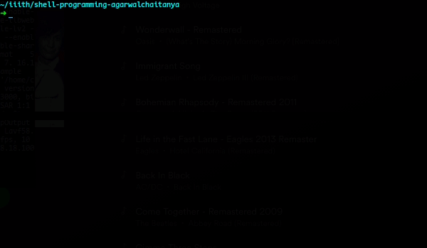
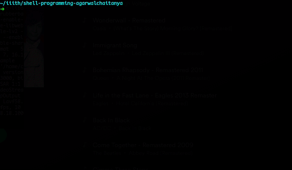
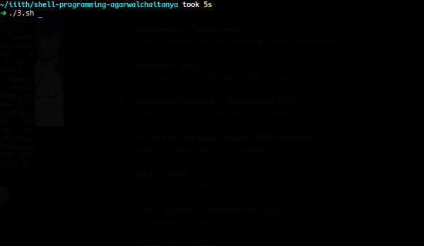
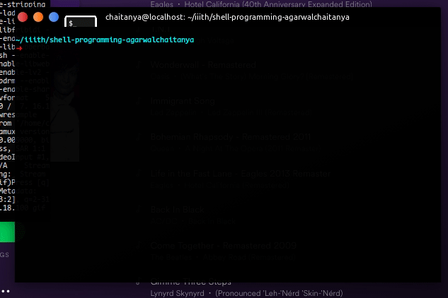

# CSO-Scripting-Assignment
## Installation:
```
git clone https://github.com/IIIT-CSG/shell-programming-agarwalchaitanya
cd shell-programming-agarwalchaitanya
chmod 755 *
```
## [1]
### Question: Given a folder, print the file which occupies the highest amount of disk space.
run `./1.sh `



## [2]
### Question: Write a shell script which given a folder and date as parameters, moves all the files older than that date to a folder archive-date.
run `./2.sh <dir> <date> ` where  date is of the form YYYYMMDDHHmm



## [3]
### Question: Print top N memory consuming applications every x second.
run ` ./3.sh <number_of_processes> <refresh_rate> `



## [4]
### Question:  Write a shell function which launches as tmux session with a horizontally split screen and split the top half vertically. In the top left pane, it should run htop, in the top right, it should display a running clock and in the bottom one, it should run tcpdump at the bottom one, filtered on port 443 and 80 for tcp connections.
```
source 4.sh
launchtmux
```

